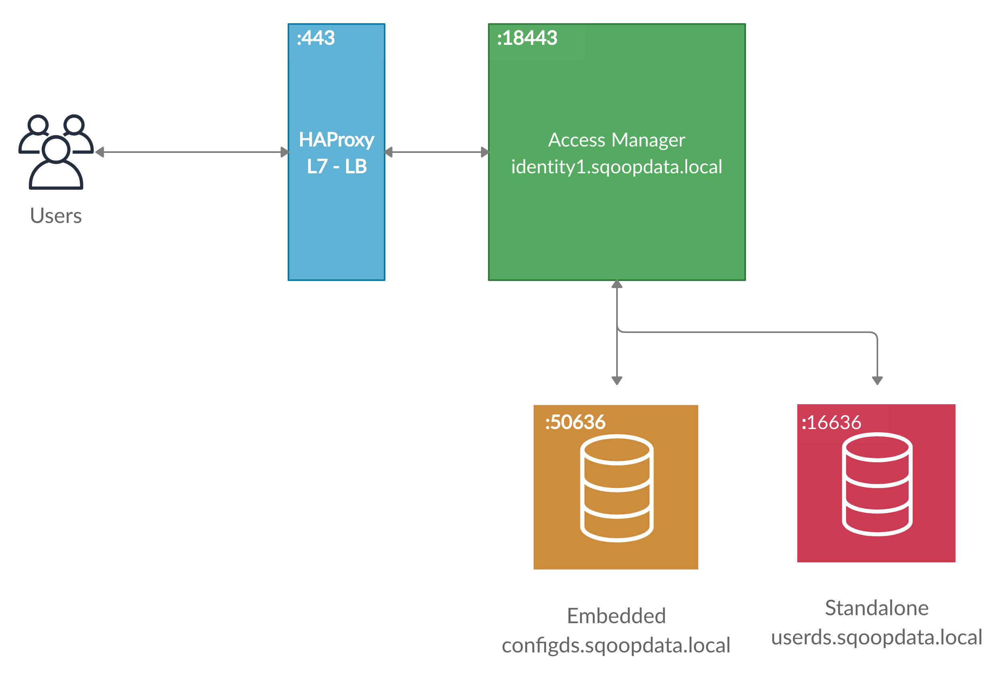

# Introduction

In this branch, we'll go through the steps to set-up minimal ForgeRock architecture that we will use in other branches/videos to test various IAM features available within ForgeRock Identity Platform. 

## Video Link 

TBA

## Architecture

# Disclaimer

The source-code and configuration in this repository is in no way intended for direct production environment, and is provided for the sole purpose to demonstrate and teach various features available within ForgeRock Identity Platform. 
